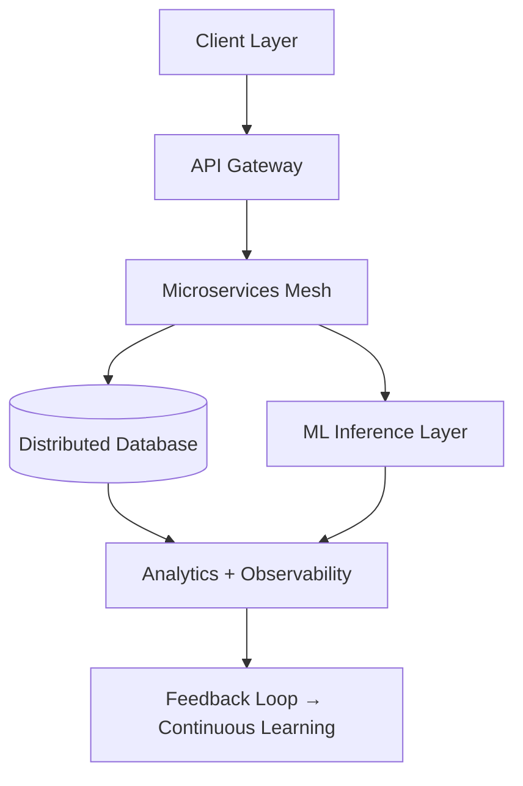

# Verta

> *Infrastructure woven with precision distributed systems engineered with conviction*

---

## Preface

Verta is not merely an engineering collective it is a doctrine of precision Our pursuit is to orchestrate systems that transcend convention and bend complexity into elegance We architect with Java Go and Python we shape infra with DevOps artistry and we lean into the rigor of open source as a shared covenant

This repository is the canonical nexus of our collective vision A convergence of infrastructure tooling distributed backend systems and the experimental edges of artificial intelligence

---

## Ethos

* **Purity of Design** every artifact must echo the principle of simplicity hidden within intricacy
* **Systems First** infrastructure and distribution are not afterthoughts they are the premise
* **Communal Intelligence** open source is not an obligation it is our natural dialect
* **AI Affinity** we embed intelligence not as garnish but as structural marrow

---

## Technical Strata

### Core Competencies

* **Backend Engineering**
  Java Spring Boot Go concurrency Python async pipelines

* **Infrastructure**
  DevOps automation container orchestration cloud-native scaling observability systems

* **Distributed Systems**
  Consensus protocols event-driven architecture message brokers CAP-aware design

* **Artificial Intelligence**
  ML pipelines vector databases inferencing APIs integrations with distributed runtimes

---

## Diagrammatic Insight



---

## Intellectual Constructs

* **Resilient Architectures** → tolerating chaos without conceding performance
* **Idempotent Operations** → actions repeatable without inconsistency
* **Temporal Guarantees** → latencies profiled bounded and predicted
* **Automated Concord** → infra that scales itself without human decree

---

## Roadmap

1. **Phase I** Deepening infra abstractions for distributed orchestration
2. **Phase II** Expansive ML embedding with real-time feedback loops
3. **Phase III** Federated intelligence across clusters and clouds
4. **Phase IV** Self-healing ecosystems with emergent behavior

---

## Graphical Impression

```mermaid
gantt
    title Verta Evolution Roadmap
    dateFormat  YYYY-MM-DD
    section Phase I
    Infra Abstractions        :done,    des1, 2025-01-01, 2025-03-30
    section Phase II
    ML Embedding              :active,  des2, 2025-04-01, 2025-06-30
    section Phase III
    Federated Intelligence    :planned, des3, 2025-07-01, 2025-10-30
    section Phase IV
    Self-Healing Ecosystems   :planned, des4, 2025-11-01, 2026-02-28
```

---

## Engagement

Verta thrives not on isolated brilliance but on shared rigor Contributions are welcomed under a covenant of discipline every pull request is a philosophical negotiation not just a patch

---

## Invocation

If you choose to interact with Verta understand you are not joining a project You are participating in a canon of infrastructure thinking A language spoken only by those who see the elegance hidden inside the labyrinth

---

## Connect

📩 **Email** → [verta.connect@gmail.com](mailto:verta.connect@gmail.com)
📸 **Instagram** → [go.verta](https://instagram.com/go.verta)

---

💡 *Built with conviction by engineers who believe in the inevitability of elegant systems*
© 2025 Verta Collective Licensed under MIT
