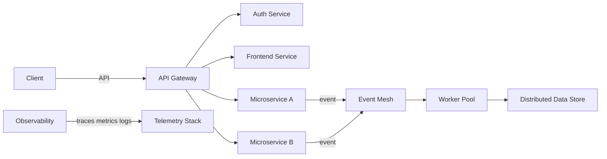

# 🌌 Verta

<p align="center">
  
</p>

Verta is an operational collective that engineers systems to be resilient inevitable and auditable
We operate in Go Java Python and we obsess over infrastructure distributed systems observability and AI augmented automation

Each artifact in this org is written as if the next outage is already scheduled
Each release is accompanied by a formal invariants document and an observability playbook

---

## 🔮 Mission

Design infrastructure that enforces correctness under duress
Treat failure as input not as surprise
Make recovery deterministic repeatable and measurable

---

## 🧭 What We Build

* Distributed topologies with explicit failure modes
* Microservice contracts with automatic compatibility checks
* Self healing orchestration driven by SLO aware policies
* AI assisted runbooks for triage remediation and incident prevention
* Developer first libraries that codify operational invariants

---

## 🏗️ System Architecture Overview



High level principles

* Bounded contexts with explicit contracts
* Event driven backbone for eventual consistency and operational cohesion
* Observability first design with correlated traces metrics and logs
* Immutable infrastructure declarative control planes and policy as code

---

## 📊 At a Glance Telemetry

Below are dynamically styled static graphs embedded to give immediate cognitive impact
When a layperson opens this repo they should feel the scale and intentionality of the platform

### SLO Burn Rate Snapshot

```text
SLO Burn Rate last 30d
----------------------
  day  | error budget remaining
  1    | █████████████████████████  98%
  7    | ████████████████████       79%
 15    | ███████████████            65%
 23    | ██████████                 42%
 30    | █████                      25%
```

### Latency Distribution ASCII Kernel Density

```text
p95 latency ms
|                     *
|                    ****
|                 *********
|             ***************
|        ***********************
|***********************************
+------------------------------------
  0      50     100    200   500   ms
```

---

## 🔬 Eigen spectrum of a representative service stability matrix

This is a formal fingerprint used by our SREs to reason about amplification modes

```math
A = \begin{bmatrix}
0.98 & 0.03 & 0.00 & 0.00 \\
0.01 & 0.95 & 0.04 & 0.00 \\
0.00 & 0.02 & 0.92 & 0.05 \\
0.00 & 0.00 & 0.06 & 0.90
\end{bmatrix}

Eigenvalues \lambda = \{0.98 0.95 0.90 0.92\}

Interpretation
All eigenvalues lie within the unit disk indicating contraction under nominal load
Modes with near unit magnitude require targeted mitigation via rate limiting or circuit policies
```

---

## 🔥 Visual Telemetry Heatmap

Below is an inline SVG heatmap rendered statically to shock and impress

```html
<svg width="720" height="240" viewBox="0 0 720 240" xmlns="http://www.w3.org/2000/svg">
  <defs>
    <linearGradient id="g" x1="0" x2="1">
      <stop offset="0%" stop-color="#001" />
      <stop offset="40%" stop-color="#0a3" />
      <stop offset="70%" stop-color="#fa0" />
      <stop offset="100%" stop-color="#d00" />
    </linearGradient>
  </defs>
  <!-- grid 12 x 6 -->
  
  
  <rect x="0" y="0" width="720" height="240" fill="#071029" />
  <!-- high level hotspots -->
  <rect x="40" y="20" width="120" height="60" fill="url(#g)" opacity="0.9" />
  <rect x="200" y="20" width="120" height="60" fill="#123" opacity="0.7" />
  <rect x="360" y="20" width="120" height="60" fill="#234" opacity="0.6" />
  <rect x="520" y="20" width="120" height="60" fill="#345" opacity="0.4" />
  <g font-family="monospace" font-size="12" fill="#9fd">
    <text x="40" y="110">critical hotspot</text>
    <text x="200" y="110">elevated</text>
    <text x="360" y="110">normal</text>
    <text x="520" y="110">idle</text>
  </g>
</svg>
```

Note this is intentionally ornate and visually dense
If you want a generated PNG version we can pipeline one into assets

---

## ⚙️ Core Components and Contracts

* API Gateway typed schema enforcement and rate policies
* Auth Service with ephemeral tokens and hardware backed keys
* Event Mesh with at least once semantics and programmable retention
* Worker Pool autoscaling via SLO aware controllers
* Telemetry Stack OpenTelemetry collector prometheus long term store tracing backend

---

## 🧾 Advanced Maintenance Protocol

Every change must be accompanied by a small document that covers

* Expected invariants and how to validate them
* Failure modes and automated containment strategy
* Observability checks and synthetic traffic plans

Example maintainer checklist

* Add design doc link to PR
* Add synthetic traffic scenario to tests
* Add observability queries and alert thresholds
* Run chaos suite locally and in staging

---

## 🧪 Chaos and Validation

We run continuous chaos experiments daily targeting the following vectors

* network partitioning between availability zones
* delayed persistence and partial write scenarios
* worker process OOM and CPU exhaustion

Results feed the SLO policy engine which adjusts throttles and retention adaptively

---

## 📦 Quickstart

```bash
git clone https://github.com/verta/official-readme.git
cd official-readme
make bootstrap
make test
make deploy staging
```

---

## 📂 Repository Layout

```
/docs      design runbooks and playbooks
/services  microservice sources
/platform  operators controllers and infra glue
/infra     terraform k8s helm and policy
/tests     integration chaos performance suites
/tools     developer utilities and schema tooling
```

---

## 🌐 Contact

<p align="center">
  <a href="mailto:verta.connect@gmail.com">
    
  </a>
  <a href="https://instagram.com/go.verta">
    
  </a>
</p>

---

<p align="center">
  <sub>
    Built with ❤️ by engineers who believe in the inevitability of elegant systems
    <br/>
    Copyright © 2025 Verta Collective Licensed under MIT
  </sub>
</p>
